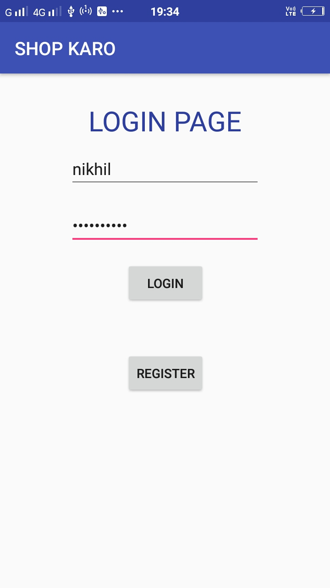
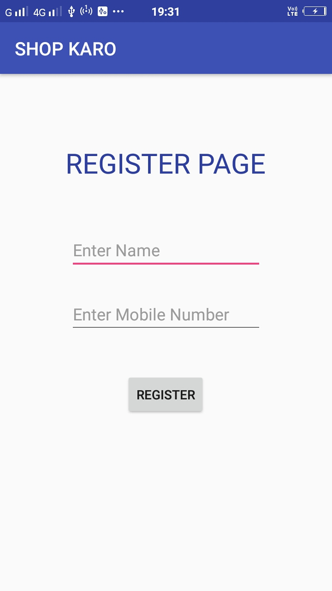
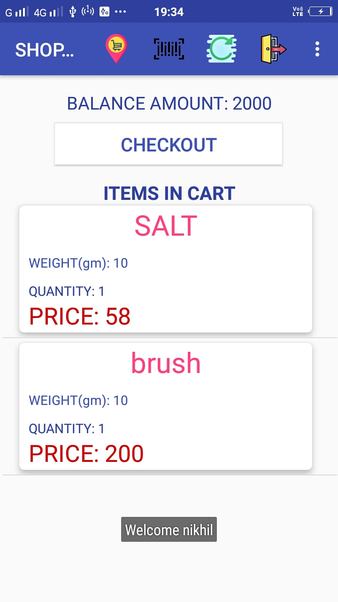
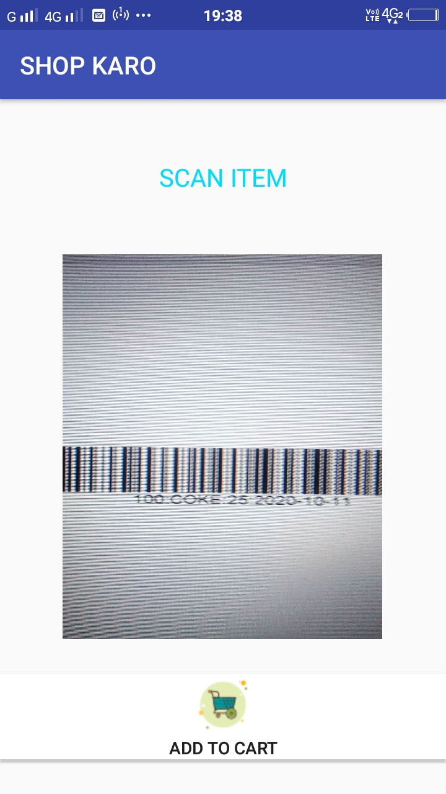
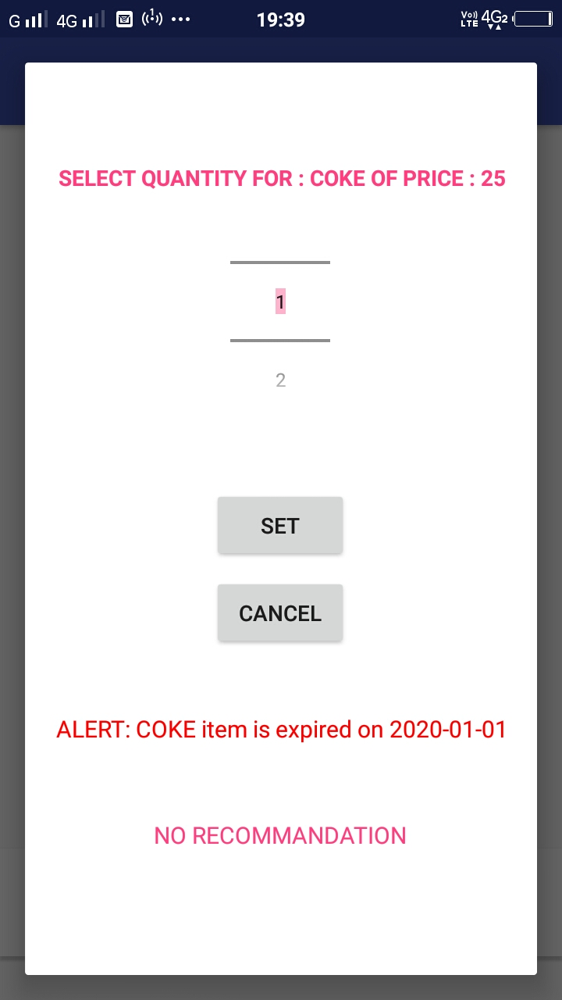
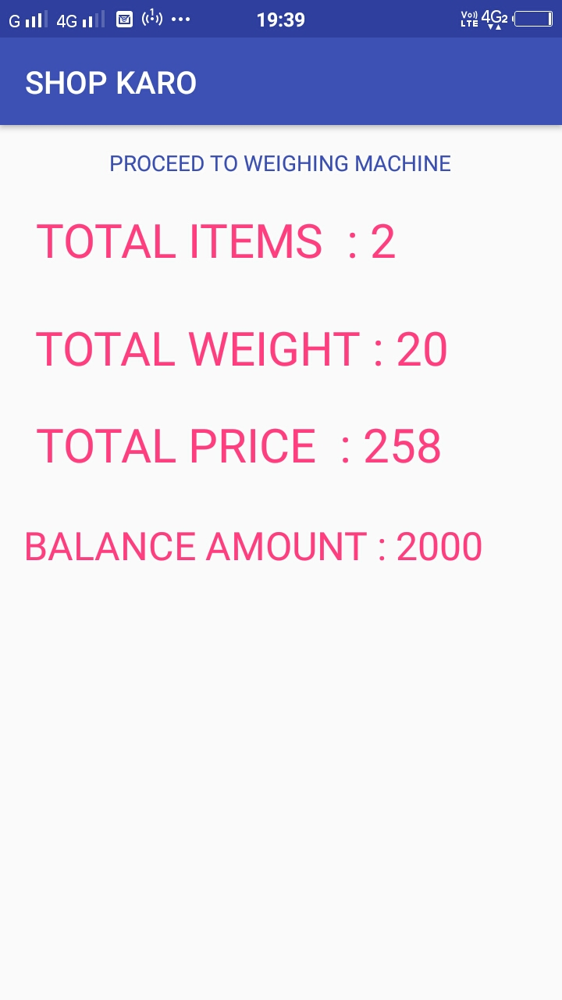

# SHOPPING-CART

A animation page of first page.

Login Page to Authenticate the user.

Register Page to register a user.

Dashboard which shows all the items added if any.

Press on top scan icon to scan. format used is <weight>:<itemname>:<price>:yyy-mm-dd ex: 100:SALT:25:2020-06-07

Select the number of Quantities. An alert message displayed if app is expired.

Checkout to weighing machine and place the items. if the wieght matches or not greater than pay and proceed.
A sample amount is detected and remaining balance is displyed in dashboard.

